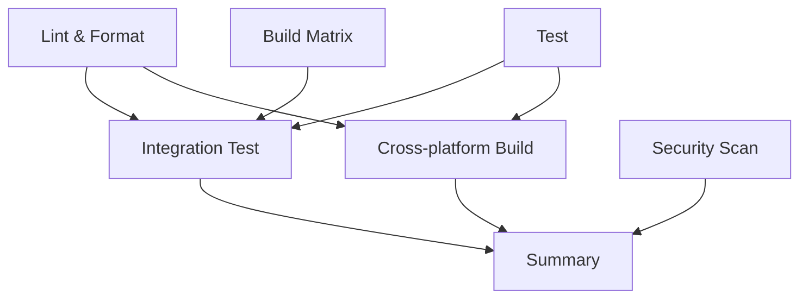

# Continuous Integration (CI) Pipeline

This document explains the CI/CD pipeline for the `forgor` CLI tool.

## Overview

The CI pipeline automatically builds, tests, and validates every pull request to ensure code quality and cross-platform compatibility. It consists of multiple jobs that run in parallel for efficiency.

## Workflows

### 1. CI Workflow (`.github/workflows/ci.yml`)

Triggers on:

- **Pull requests** to `main` branch
- **Pushes** to `main` branch

#### Jobs Overview



#### Job Details

**🔍 Lint & Format Job**

- Checks code formatting with `gofmt`
- Runs `go vet` for static analysis
- Executes `golangci-lint` for comprehensive linting
- Verifies Go module integrity

**🧪 Test Job**

- Runs all unit tests with race detection
- Generates code coverage reports
- Enforces minimum coverage threshold (50%)
- Uploads coverage artifacts

**🔨 Build Matrix Job**

- Tests builds on multiple OS: Ubuntu, macOS, Windows
- Tests with Go versions: 1.20, 1.21
- Verifies binary execution
- Uploads build artifacts

**🌍 Cross-platform Build Job** (PRs only)

- Builds for all target platforms:
  - Linux (amd64, arm64, arm)
  - macOS (amd64, arm64)
  - Windows (amd64)
- Creates checksums
- Uploads cross-platform artifacts

**🔐 Security Scan Job**

- Runs Gosec security scanner
- Uploads SARIF results for GitHub Security tab

**📊 Integration Test Job**

- Downloads and tests actual binary
- Validates CLI commands work correctly
- Tests help output and version information

**📋 Summary Job**

- Collects results from all jobs
- Creates GitHub Step Summary
- Shows overall CI status

### 2. Version Check Workflow (`.github/workflows/version-check.yml`)

**Purpose**: Enforces version bumps on every PR/push to main

**What it checks**:

- VERSION file exists and has valid format
- Version is increased for PRs
- New version is greater than previous version

### 3. Release Workflow (`.github/workflows/release.yml`)

**Purpose**: Automates releases when version tags are pushed

**Features**:

- Builds for all platforms
- Creates GitHub releases
- Attaches binaries and checksums
- Extracts changelog information

## CI Requirements

### For Pull Requests

All of these must pass before merging:

✅ **Code Quality**

- Code must be properly formatted (`gofmt`)
- Must pass static analysis (`go vet`, `golangci-lint`)
- No linting errors or warnings

✅ **Testing**

- All tests must pass
- Test coverage must be ≥ 50%
- Race conditions must not be detected

✅ **Building**

- Must build successfully on all target platforms
- Binary must execute without errors
- Version information must be embedded correctly

✅ **Security**

- Must pass security scanning
- No known vulnerabilities

✅ **Versioning**

- VERSION file must be bumped
- Version format must be valid SemVer

### For Main Branch

Additional requirements for pushes to main:

✅ **Version Enforcement**

- Every commit must increase the version
- Version history must be monotonic

## Artifacts

The CI pipeline produces several artifacts:

### Test Artifacts

- `coverage-report`: HTML and raw coverage files
- Available for 90 days

### Build Artifacts

- `forgor-{os}-go{version}`: Platform-specific binaries
- `forgor-cross-platform-pr{number}`: All platform binaries (PRs only)
- Available for 30 days

### Security Artifacts

- SARIF security scan results
- Automatically uploaded to GitHub Security tab

## Local Development

### Running CI Checks Locally

```bash
# Format code
make fmt

# Run linting
make lint

# Run tests with coverage
make test-coverage

# Build for current platform
make build

# Build for all platforms
make build-all

# Check version format
make version-check
```

### Pre-commit Checklist

Before creating a PR, ensure:

```bash
# 1. Code is formatted
make fmt

# 2. Tests pass
make test

# 3. Version is bumped (for main branch PRs)
make version-bump-patch  # or minor/major

# 4. Build works
make build

# 5. Lint passes
make lint  # (optional, CI will catch this)
```

## Configuration

### Coverage Threshold

The minimum test coverage is set to **50%** in the CI workflow:

```yaml
THRESHOLD=50
if (( $(echo "$COVERAGE < $THRESHOLD" | bc -l) )); then
echo "❌ Test coverage ($COVERAGE%) is below threshold ($THRESHOLD%)"
exit 1
fi
```

To change this, modify the `THRESHOLD` value in `.github/workflows/ci.yml`.

### Supported Platforms

The CI builds and tests on:

**Development Testing:**

- Ubuntu Latest + Go 1.20, 1.21
- macOS Latest + Go 1.20, 1.21
- Windows Latest + Go 1.20, 1.21

**Release Targets:**

- linux/amd64, linux/arm64, linux/arm
- darwin/amd64, darwin/arm64
- windows/amd64

### Build Flags

All binaries are built with version information:

```bash
LDFLAGS="-X 'forgor/cmd.Version=$VERSION' -X 'forgor/cmd.GitCommit=$COMMIT' -X 'forgor/cmd.BuildDate=$BUILD_DATE'"
```

## Troubleshooting

### Common CI Failures

**❌ Formatting Issues**

```bash
# Fix locally
make fmt
git add . && git commit -m "fix: code formatting"
```

**❌ Test Failures**

```bash
# Run tests locally
make test
# Fix failing tests, then commit
```

**❌ Coverage Too Low**

```bash
# Check current coverage
make test-coverage
# Add more tests to increase coverage
```

**❌ Version Not Bumped**

```bash
# Bump version for PR
make version-bump-patch
git add VERSION && git commit -m "chore: bump version"
```

**❌ Build Failures**

```bash
# Test build locally
make build
# Fix build issues, then commit
```

### Debug CI Issues

1. **Check job logs** in GitHub Actions tab
2. **Download artifacts** to inspect build outputs
3. **Run equivalent commands locally** using Makefile targets
4. **Check dependencies** with `go mod verify`

### CI Performance

The CI pipeline is optimized for speed:

- **Parallel jobs** run simultaneously when possible
- **Go module caching** reduces dependency download time
- **Build matrix** tests multiple configurations efficiently
- **Conditional jobs** (cross-platform build only on PRs)

Typical CI run time: **3-5 minutes** for PRs

## Security

### SARIF Integration

Security scan results are automatically uploaded to GitHub's Security tab, providing:

- **Vulnerability detection** in dependencies
- **Code security analysis** with Gosec
- **Centralized security dashboard**

### Artifact Security

- Build artifacts are **temporary** (30-90 days)
- No secrets are included in build outputs
- Version information is embedded safely

## GitHub Integration

### Status Checks

All CI jobs appear as **required status checks** on PRs:

- `lint-and-format`
- `test`
- `build`
- `integration-test`
- `security-scan`

### PR Summary

The Summary job creates a detailed report in the PR:

```
## CI Summary

✅ **Lint & Format**: Passed
✅ **Tests**: Passed
✅ **Build**: Passed
✅ **Cross-platform Build**: Passed
✅ **Integration Tests**: Passed

**PR is ready for review!** 🎉
```

This system ensures every change to `forgor` maintains high quality and works reliably across all supported platforms.
