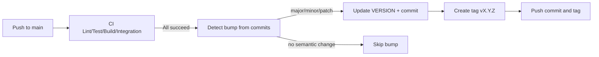
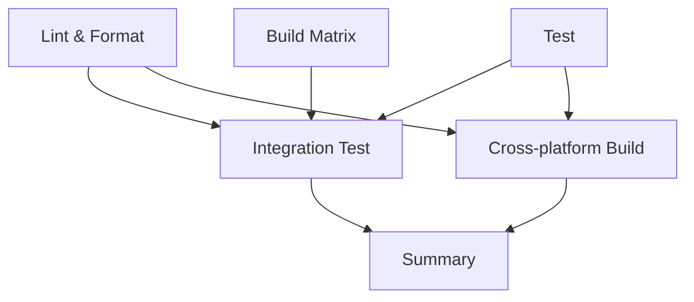

# Continuous Integration (CI) Pipeline

This document explains the CI/CD pipeline for the `forgor` CLI tool.

## Overview

The CI pipeline automatically builds, tests, and validates every pull request to ensure code quality and cross-platform compatibility. It consists of multiple jobs that run in parallel for efficiency.

## Automated Versioning

On pushes to main, after CI jobs pass, the workflow automatically determines and bumps the semantic version based on commit messages and pushes a tag.


```mermaid
graph LR
    A[Push to main] --> B[CI Lint/Test/Build/Integration]
    B -->|All succeed| C[Detect bump from commits]
    C -->|major/minor/patch| D[Update VERSION + commit]
    D --> E[Create tag vX.Y.Z]
    E --> F[Push commit and tag]
    C -->|no semantic change| G[Skip bump]
```

Key Points:
- ✅ Commit-message–driven using Conventional Commits
- ✅ No manual edits to VERSION or tags
- ✅ Only runs on pushes to main after all CI jobs succeed
- ✅ Skips if no semantic changes are detected

## Workflows

### 1. CI Workflow (`.github/workflows/ci.yml`)

Triggers on:

- **Pull requests** to `main` branch
- **Pushes** to `main` branch

#### Jobs Overview


```mermaid
graph TD
    A[Lint & Format] --> D[Integration Test]
    B[Test] --> D
    C[Build Matrix] --> D
    A --> E[Cross-platform Build]
    B --> E
    D --> G[Summary]
    E --> G
```

#### Job Details

**🔍 Lint & Format Job**

- Checks code formatting with `gofmt`
- Runs `go vet` for static analysis
- Executes `golangci-lint` for comprehensive linting
- Verifies Go module integrity

**🧪 Test Job**

- Runs all unit tests with race detection
- Generates code coverage reports
- Enforces minimum coverage threshold (5%)
- Uploads coverage artifacts

**🔨 Build Matrix Job**

- Tests builds on multiple OS: Ubuntu, macOS
- Tests with Go versions: 1.24
- Verifies binary execution
- Uploads build artifacts

**🌍 Cross-platform Build Job** (PRs only)

- Builds for all target platforms:
  - Linux (amd64, arm64, arm)
  - macOS (amd64, arm64)
  - Windows (amd64)
- Creates checksums
- Uploads cross-platform artifacts


**📊 Integration Test Job**

- Downloads and tests actual binary
- Validates CLI commands work correctly
- Tests help output and version information

**📋 Summary Job**

- Collects results from all jobs
- Creates GitHub Step Summary
- Shows overall CI status

### 2. Automatic Versioning (part of CI workflow)

Purpose: Automatically bumps the project version and creates a tag based on commit messages when pushing to main.

How it works:
1. Runs after lint, test, build, and integration-test succeed on a push to main.
2. Detects the previous base version from the latest tag (or VERSION file if no tags).
3. Parses commit messages since the last tag using Conventional Commits:
   - Major: presence of "BREAKING CHANGE" or the "!" syntax (e.g., feat!: ...)
   - Minor: feat:
   - Patch: fix:, perf:, refactor:
4. If a bump is needed, updates VERSION, commits with "chore(release): vX.Y.Z [skip ci]", creates tag vX.Y.Z, and pushes both to main.
5. If no semantic changes are found, the step is skipped.

Notes:
- Follow Conventional Commits for predictable bump behavior.
- A Release workflow publishes GitHub Releases when tags matching v* are pushed.

## CI Requirements

### For Pull Requests

All of these must pass before merging:

✅ **Code Quality**

- Code must be properly formatted (`gofmt`)
- Must pass static analysis (`go vet`, `golangci-lint`)
- No linting errors or warnings

✅ **Testing**

- All tests must pass
- Test coverage must be ≥ 5%
- Race conditions must not be detected

✅ **Building**

- Must build successfully on all target platforms
- Binary must execute without errors
- Version information must be embedded correctly


✅ Versioning

- Automated by CI based on commit messages (Conventional Commits)

### For Main Branch

Additional behavior for pushes to main:

✅ Automatic Versioning

- Version bump is computed from commit messages after successful CI
- Use Conventional Commits to control bump level (feat/fix/feat!/BREAKING CHANGE)

## Artifacts

The CI pipeline produces several artifacts:

### Test Artifacts

- `coverage-report`: HTML and raw coverage files
- Available for 90 days

### Build Artifacts

- `forgor-{os}-go{version}`: Platform-specific binaries
- `forgor-cross-platform-pr{number}`: All platform binaries (PRs only)
- Available for 30 days


## Local Development

### Running CI Checks Locally

```bash
# Format code
make fmt

# Run linting
make lint

# Run tests with coverage
make test-coverage

# Build for current platform
make build

# Build for all platforms
make build-all


```

### Pre-commit Checklist

Before creating a PR, ensure:

```bash
# 1. Code is formatted
make fmt

# 2. Tests pass
make test

# 3. Commit message follows Conventional Commits
#    e.g., feat:, fix:, or feat!:/BREAKING CHANGE to control bump

# 4. Build works
make build

# 5. Lint passes
make lint  # (optional, CI will catch this)
```

## Configuration

### Coverage Threshold

The minimum test coverage is set to **5%** in the CI workflow:

```yaml
THRESHOLD=5
COVERAGE_NUM=$(echo "$COVERAGE" | awk '{print int($1)}')
if [ "$COVERAGE_NUM" -lt "$THRESHOLD" ]; then
  echo "❌ Test coverage ($COVERAGE%) is below threshold ($THRESHOLD%)"
  exit 1
fi
```

To change this, modify the `THRESHOLD` value in `.github/workflows/ci.yml`.

### Supported Platforms

The CI builds and tests on:

**Development Testing:**

- Ubuntu Latest + Go 1.24
- macOS Latest + Go 1.24

**Release Targets:**

- linux/amd64, linux/arm64, linux/arm
- darwin/amd64, darwin/arm64
- windows/amd64

### Build Flags

All binaries are built with version information:

```bash
LDFLAGS="-X 'forgor/cmd.Version=$VERSION' -X 'forgor/cmd.GitCommit=$COMMIT' -X 'forgor/cmd.BuildDate=$BUILD_DATE'"
```

## Troubleshooting

### Common CI Failures

**❌ Formatting Issues**

```bash
# Fix locally
make fmt
git add . && git commit -m "fix: code formatting"
```

**❌ Test Failures**

```bash
# Run tests locally
make test
# Fix failing tests, then commit
```

**❌ Coverage Too Low**

```bash
# Check current coverage
make test-coverage
# Add more tests to increase coverage
```

**❌ Version Not Bumped**

Ensure your commit message follows Conventional Commits so CI can infer the bump level on push to main:
- feat: ... → minor
- fix: ... → patch
- feat!: ... or include "BREAKING CHANGE:" in the body → major
- docs:, chore:, ci:, test: → no bump

**❌ Build Failures**

```bash
# Test build locally
make build
# Fix build issues, then commit
```

### Debug CI Issues

1. **Check job logs** in GitHub Actions tab
2. **Download artifacts** to inspect build outputs
3. **Run equivalent commands locally** using Makefile targets
4. **Check dependencies** with `go mod verify`

### CI Performance

The CI pipeline is optimized for speed:

- **Parallel jobs** run simultaneously when possible
- **Go module caching** reduces dependency download time
- **Build matrix** tests multiple configurations efficiently
- **Conditional jobs** (cross-platform build only on PRs)

Typical CI run time: **3-5 minutes** for PRs


### Artifact Security

- Build artifacts are **temporary** (30-90 days)
- No secrets are included in build outputs
- Version information is embedded safely

## GitHub Integration

### Status Checks

All CI jobs appear as **required status checks** on PRs:

- `lint-and-format`
- `test`
- `build`
- `integration-test`


### PR Summary

The Summary job creates a detailed report in the PR:

```
## CI Summary

✅ **Lint & Format**: Passed
✅ **Tests**: Passed
✅ **Build**: Passed
✅ **Cross-platform Build**: Passed
✅ **Integration Tests**: Passed

**PR is ready for review!** 🎉
```

This system ensures every change to `forgor` maintains high quality and works reliably across all supported platforms.

## Release Process

Releases are driven by automatic version bumps on push to main:

- After CI succeeds on main, the workflow updates VERSION, creates a tag vX.Y.Z, and pushes both.
- The bump level is determined by commit messages (Conventional Commits).
- A tag push (v*) triggers the Release workflow to publish a GitHub Release via GoReleaser.

To influence the next version:
- Use feat: for a minor bump, fix:/perf:/refactor: for a patch, and feat!:/BREAKING CHANGE for a major.
- Non-semantic commits (docs:, chore:, ci:, test:) do not trigger a bump.

If you need a formal GitHub Release with assets, we can add a follow-up workflow that triggers on tag creation.
